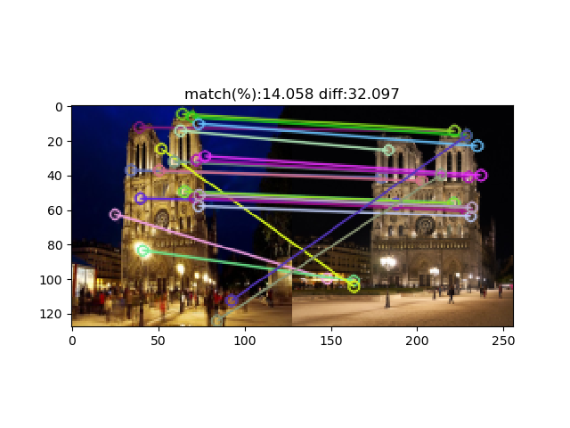

# image_matching_hist
- Implementing image matching using SIFT.
- Calculating the total difference between color histogram of all matching points.
## Requirements
- Docker
## Usage
### SIFT
Confirm the following codes in Dockerfile
```
ADD sift.py .
RUN pip install opencv-python
```
Run the following commands
```
docker build -t sift ./
docker run -v ${PWD}:/code sift
```
## Results
### SIFT

